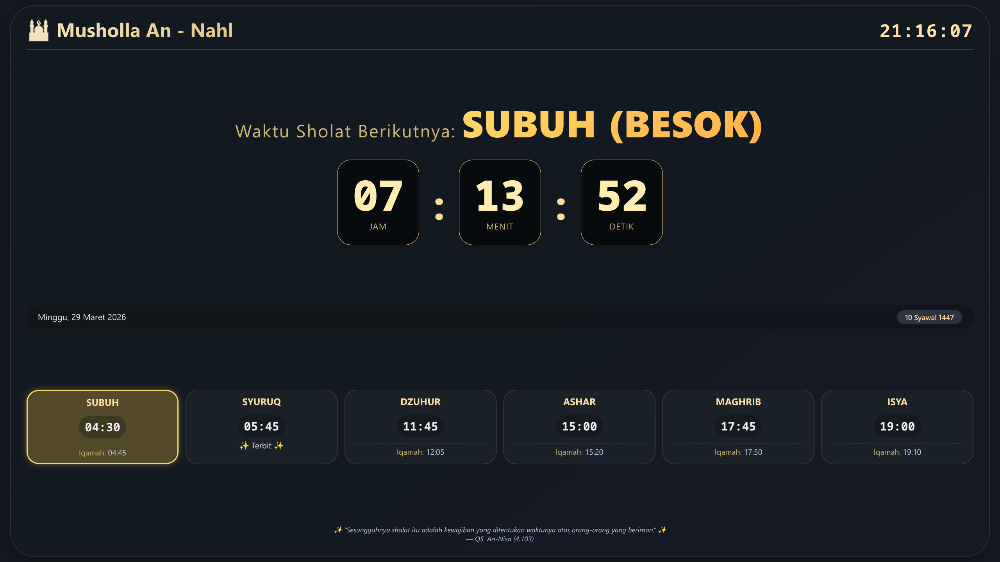

# 🕌 Kiosk Jadwal Sholat — Musholla An-Nahl

> **Vibe Coding Prayer Time** — Tampilan kiosk/TV jadwal sholat untuk Musholla An-Nahl, Surabaya.



## Fitur

- **Live clock** — Jam digital real-time dengan format HH:MM:SS
- **Next prayer countdown** — Hitung mundur waktu sholat berikutnya (Jam:Menit:Detik)
- **6 jadwal sholat** — Subuh, Syuruq, Dzuhur, Ashar, Maghrib, Isya
- **Waktu Iqamah** — Offset menit untuk setiap sholat
- **Tanggal Masehi & Hijriah** — Lengkap dengan nama bulan Indonesia
- **Countdown highlight** — Sholat berikutnya akan disorot

## Sumber Data

1. **Aladhan API** — `api.aladhan.com` (online, method 11 — Singapura sesuai Kemenag RI)
2. **Adhan.js v4** — Perhitungan lokal (fallback jika API gagal)
3. **Hardcoded fallback** — Jadwal statis sebagai pilihan terakhir

## Lokasi

- **Musholla An-Nahl**, Surabaya
- Koordinat: `-7.4281, 112.699`
- Metode Kemenag RI: Subuh 20°, Isya 18°

## Cara Pakai

Buka `index.html` di browser — langsung jalan. Cocok untuk kiosk display / TV.

**Simulasi waktu** (testing):
```
?sim=2026-03-29T22:30:00
```

## Tech Stack

- HTML/CSS/JS vanilla (no framework)
- Theme: Dark/gold dengan gradient, full-screen kiosk layout
- Font monospace untuk waktu, Poppins/Inter untuk teks
